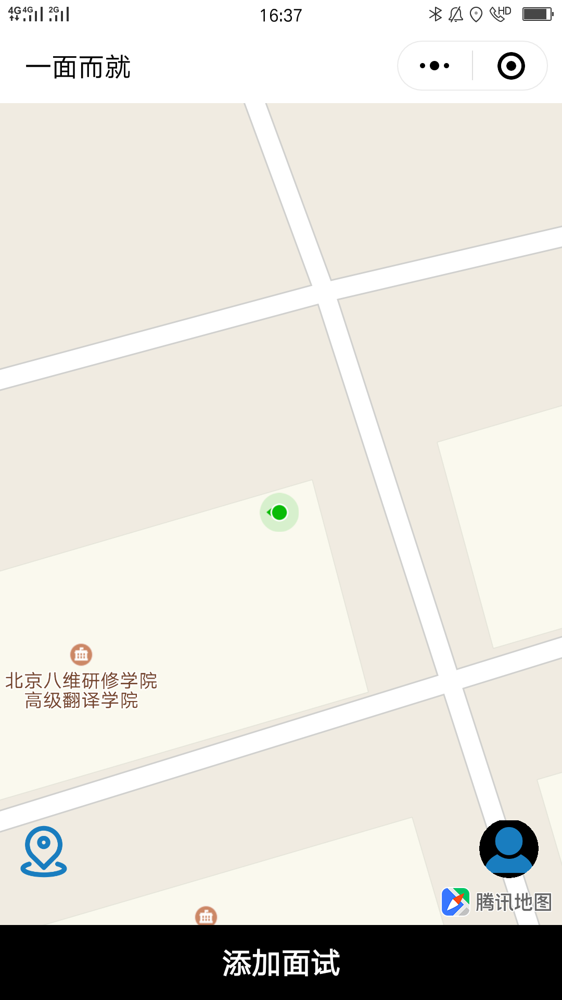
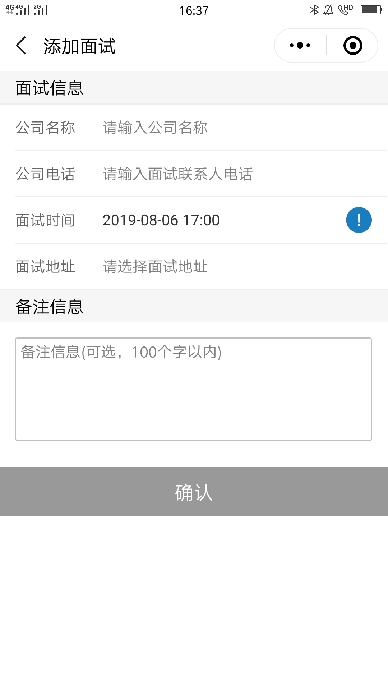
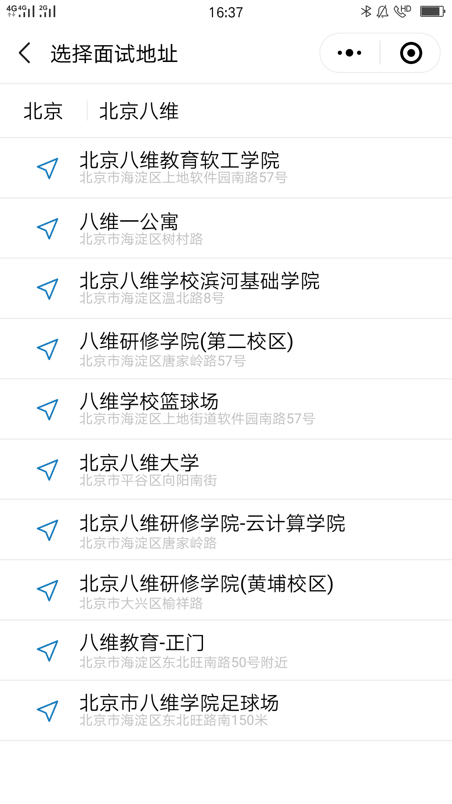

<!--
 * @Description: In User Settings Edit
 * @Author: klf
 * @Date: 2019-08-08 22:05:46
 * @LastEditTime: 2019-08-09 07:42:32
 * @LastEditors: Please set LastEditors
 -->
## About
一面而就项目是一款关于生活服务的微信小程序（为用户科学安排面试行程），基于webpack+原生api+mpvue+vuex框架

## 技术栈
- mpvue(核心框架)
- vuex(同redux,是一个数据管理库, 单项数据流)
- better-scroll(使移动端滑动体验更加流畅)
- moment(计算时间的插件)
- 腾讯地图实时定位


## 项目运行

```
前端

git clone git@github.com:Katherinekali/The-interview-assistant.git

cd The-interview-assistant

npm install

npm start

(服务器地址是  fly.config.baseURL = 'https://sign.jasonandjay.com/'，在request文件里)
```
## 功能列表

- [x] 登录验证功能
- [x] 首页
    - [x] 添加地图
    - [x] 实时定位
- [x] 添加面试
     - [x] 列表渲染
     - [x] 添加评论
     - [x] 添加留言
     - [x] 根据关键字搜索相关地址
     - [x] 面试时间的计算
      
- [ ] 面试列表
    - [ ] tab切换获取相应的数据接口进行渲染
    - [ ] 点击详情进入
    - [ ] scroll滑动
    - [ ] 点击获取相应的数据
- [ ] 面试详情
    - [ ] 判断是否到达目的地进行打卡
    - [ ] 改变面试的状态
- [ ] 个人中心
    


<figure >

</figure >

## 页面截图

|         首页         |          添加面试         |        面试列表          |     
| :------------------: | :----------------------: | :-------------------: | 
|  |  |  |

|         面试详情         |             打卡          |        个人中心        |
| :-------------------: |  :-------------------------: |:------------------: |
|  |   | |


## 关于您的建议

> -  正在更新维护状态，部分功能尚未没完成。
> - 倘若您发现 Bug 或者有优化意见及其他宝贵意见，欢迎您提交 issue 或者联系我 qq = 1036877137 、Email = klf960421@163.com
> - EasyMarket 服务端 ，请移步至 [EasyMarketSever](https://github.com/Katherinekali/ShoppingSpot)。

## 未完成功能

> - 支付订单、订单查询、优惠券...未来会不断完善！

## End

> - 喜欢 EasyMarket，帮忙点个 Star 吧!
> - 作者还会不断更新， 您的支持是作者不断更新的动力!
> - Thanks!

## 作者

> Name: Katherinekali && xuyuanyuan
>
> QQ: 1036877137
>
> Email：klf960421@163.com
